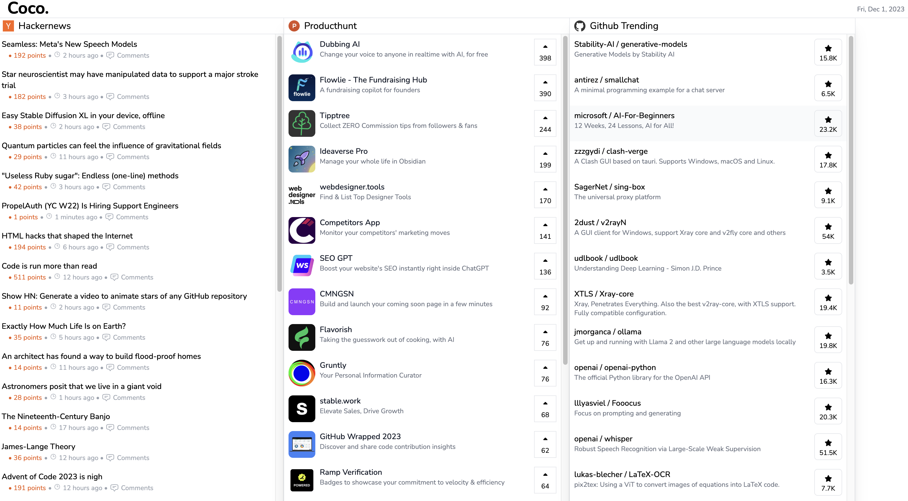

# COCO.

A modern tech news aggregator built right into the web. 

Built using:
- [React](https://react.dev/)
- [Tailwind CSS](https://tailwindcss.com/)
- [GraphQL](https://graphql.org/)
- [Vite](https://vitejs.dev/)

API's used:
- [Hacker News API](https://github.com/HackerNews/API)
- [Github Trending Repositories](https://github.com/alisoft/github-trending-api)
- [Product Hunt API](https://api.producthunt.com/v2/docs)

